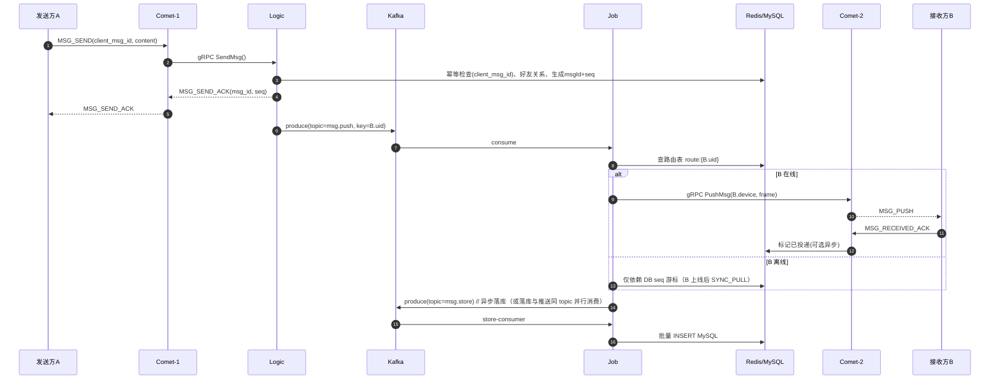

# LinkIM 分布式即时通讯系统设计方案

| 项目   | 内容                                     |
| ---- | -------------------------------------- |
| 文档版本 | v1.0                                   |
| 技术栈  | Go + WebSocket + Kafka + Redis + MySQL |
| 阅读对象 | 后端研发、架构师、运维                            |
| 更新日期 | 2026-09-03                             |

---

## 目录

1. [项目概述](#1-项目概述)
2. [整体架构](#2-整体架构)
3. [技术选型](#3-技术选型)
4. [通信协议设计](#4-通信协议设计)
5. [核心流程](#5-核心流程)
6. [消息可靠性保证](#6-消息可靠性保证)
7. [在线状态与连接路由](#7-在线状态与连接路由)
8. [Kafka 消息通道设计](#8-kafka-消息通道设计)
9. [存储设计](#9-存储设计)
10. [离线消息与多端同步](#10-离线消息与多端同步)
11. [群聊与扩散设计](#11-群聊与扩散设计)
12. [高可用设计](#12-高可用设计)
13. [水平扩展与容量规划](#13-水平扩展与容量规划)
14. [安全设计](#14-安全设计)
15. [性能优化](#15-性能优化)
16. [可观测性](#16-可观测性)
17. [部署架构](#17-部署架构)
18. [风险与演进路线](#18-风险与演进路线)

---

## 1. 项目概述

### 1.1 背景

LinkIM 是一套面向中大规模用户量的分布式即时通讯系统，支持单聊、群聊、多端登录、离线消息等核心能力。系统需要在保证消息**不丢、不重、有序**的前提下，支撑十万级至百万级长连接并发。

### 1.2 设计目标

| 目标          | 指标                    |
| ----------- | --------------------- |
| 单集群长连接并发    | ≥ 100 万（可水平扩展）        |
| 消息端到端延迟（在线） | P99 < 500ms           |
| 消息可靠性       | 不丢、不重、会话内有序           |
| 系统可用性       | 99.95%（单组件故障不丢失连接与消息） |
| 峰值消息吞吐      | 10 万条/秒               |
| 离线消息拉取      | 首屏 < 1s，支持增量同步        |

### 1.3 非目标（本期不做）

- 音视频通话、文件存储（对象存储另建服务，IM 仅传消息信令）
- 端到端加密（E2EE，规划在演进路线中）
- 跨数据中心多活（先做单机房高可用）

---

## 2. 整体架构

### 2.1 架构分层

系统采用经典三层架构：**接入层（Comet）→ 逻辑层（Logic）→ 推送层（Job）**，底层由 Kafka 解耦异步消息流，Redis 提供路由与缓存，MySQL 提供持久化存储。

```
                          ┌─────────────────────┐
                          │   LB (LVS/Nginx)    │  TCP/WS 负载均衡
                          └─────────┬───────────┘
                                    │
        ┌───────────────────────────┼───────────────────────────┐
        │            接入层 Comet 集群（无状态化长连接网关）        │
        │   ┌─────────┐   ┌─────────┐   ┌─────────┐   ┌──────┐ │
        │   │ comet-1 │   │ comet-2 │   │ comet-3 │...│ cometN│ │
        │   └────┬────┘   └────┬────┘   └────┬────┘   └──┬───┘ │
        └────────┼─────────────┼─────────────┼───────────┼─────┘
                 │  gRPC       │             │           │
        ┌────────▼─────────────▼─────────────▼───────────▼─────┐
        │              逻辑层 Logic 集群（无状态业务服务）          │
        │   鉴权 / 消息校验 / 关系检查 / 序列号生成 / 写入 Kafka   │
        └───────┬──────────────────────────────────────┬───────┘
                │                                      │
        ┌───────▼────────┐                     ┌───────▼────────┐
        │     Kafka      │   msg 流转异步解耦    │     Redis      │
        │  (消息总线)     │                     │ 路由/seq/在线态  │
        └───────┬────────┘                     └────────────────┘
                │
        ┌───────▼────────┐
        │  Job 推送层     │  消费 Kafka：投递给 Comet / 异步落库 MySQL
        └───────┬────────┘
                │
        ┌───────▼────────┐
        │     MySQL      │  消息/会话/关系 持久化（分库分表）
        └────────────────┘
```

### 2.2 组件职责

| 组件             | 职责                                                | 关键约束                            |
| -------------- | ------------------------------------------------- | ------------------------------- |
| **Comet（接入层）** | 维持 WebSocket 长连接；协议编解码；心跳保活；消息下行推送                | 不做业务逻辑；连接数是唯一状态，需配合路由表实现"逻辑无状态" |
| **Logic（逻辑层）** | 登录鉴权、消息合法性校验、好友/群关系检查、生成消息 ID 与会话 seq、生产消息到 Kafka | 完全无状态，可任意扩缩容                    |
| **Job（推送层）**   | 消费 Kafka：查询路由表定位接收者所在 Comet 并投递；消费消息异步批量写入 MySQL  | 水平扩展，与 Kafka 分区数对齐              |
| **Redis**      | 连接路由表、会话 seq 生成器、在线状态、token 缓存、热消息缓存              | 哨兵或 Cluster 部署                  |
| **Kafka**      | 削峰填谷、异步解耦逻辑层与推送/存储                                | 消息不丢依赖 acks=all + 重试            |
| **MySQL**      | 用户、关系、群组、消息、会话的持久化                                | 按会话 ID 分库分表                     |

### 2.3 设计原则

1. **连接与业务分离**：Comet 只管"管道"，业务全部下沉 Logic，网关重启只影响连接不断业务。
2. **读写路径分离**：上行（发消息）走 Logic → Kafka；下行（收消息）走 Job → Comet，两条链路独立扩容。
3. **一切异步**：消息落库、通知、已读回执等非关键路径全部经 Kafka 异步化。
4. **幂等与确认**：所有跨服务消息传递均有唯一 ID + ACK，故障重试不产生副作用。

---

## 3. 技术选型

| 层次    | 选型        | 备选方案              | 选择理由                                                                  |
| ----- | --------- | ----------------- | --------------------------------------------------------------------- |
| 语言    | Go        | Java / Rust / C++ | goroutine 天然适合海量长连接（C10M 场景内存占用低）；生态成熟（gorilla/websocket、gnet）；编译部署简单 |
| 长连接协议 | WebSocket | TCP 私有协议 / MQTT   | 兼容 Web/小程序/H5；基于 HTTP 升级便于穿透网关；二进制帧承载私有协议                             |
| RPC   | gRPC      | HTTP/JSON         | 内部服务间调用，性能高、强类型 Protobuf 契约                                           |
| 消息队列  | Kafka     | RocketMQ / NSQ    | 超高吞吐、分区有序（会话顺序投递的核心依赖）、生态成熟                                           |
| 缓存    | Redis     | Memcached         | 需要丰富数据结构（Hash 存路由、INCR 生成 seq）；持久化可选                                  |
| 持久化   | MySQL     | TiDB / HBase      | 团队熟悉度高；按会话分片后写入可扩展；消息冷热分层降低单表压力                                       |

---

## 4. 通信协议设计

### 4.1 协议分层

WebSocket 之上承载自定义二进制协议（Protobuf 序列化），避免纯 JSON 的解析开销与安全问题，同时预留版本位支持协议升级。

```
WebSocket Frame
└── LinkIM Frame（自定义二进制头 + Protobuf Body）
```

### 4.2 帧格式

```
 0        4        6        8        12       16
 +--------+--------+--------+--------+--------+--------+
 | ver(4) | cmd(8) |seq(16) | len(32)|  body  |
 +--------+--------+--------+--------+--------+--------+
 |  1B    |  2B    |  4B    |  4B    |  len B |
 +--------+--------+--------+--------+--------+

 ver  : 协议版本，当前 1
 cmd  : 命令字（见 4.3）
 seq  : 请求序号，用于请求-响应配对（client 生成，server 原样带回）
 len  : body 长度，防粘包，上限 64KB（防恶意大包）
 body : Protobuf 编码的业务体
```

### 4.3 命令字（Cmd）

| Cmd  | 名称                | 方向  | 说明                        |
| ---- | ----------------- | --- | ------------------------- |
| 0x01 | AUTH              | C→S | 登录鉴权，携带 token             |
| 0x02 | AUTH_ACK          | S→C | 鉴权结果，携带分配的连接信息            |
| 0x03 | HEARTBEAT         | C→S | 心跳（应用层，30s 一次）            |
| 0x04 | HEARTBEAT_ACK     | S→C | 心跳响应                      |
| 0x05 | MSG_SEND          | C→S | 发送消息                      |
| 0x06 | MSG_SEND_ACK      | S→C | 服务端已接收确认（携带服务端 msgId、seq） |
| 0x07 | MSG_PUSH          | S→C | 推送新消息                     |
| 0x08 | MSG_RECEIVED_ACK  | C→S | 客户端已接收确认                  |
| 0x09 | SYNC_PULL         | C→S | 增量同步离线消息（携带本地最大 seq）      |
| 0x0A | SYNC_RESP         | S→C | 同步结果                      |
| 0x0B | RECALL            | C→S | 消息撤回                      |
| 0x0C | TYPING / PRESENCE | 双向  | 正在输入、在线状态通知               |

### 4.4 Protobuf 消息定义（节选）

```protobuf
syntax = "proto3";
package linkim.protocol.v1;

// MSG_SEND 请求体
message MsgSendReq {
  string client_msg_id = 1;   // 客户端生成 UUID，用于幂等去重
  string conv_id     = 2;     // 会话 ID
  int32  conv_type   = 3;     // 1单聊 2群聊
  int32  msg_type    = 4;     // 1文本 2图片 3语音...
  bytes  payload     = 5;     // 消息体
}

// MSG_SEND_ACK 响应体
message MsgSendAck {
  int32  code        = 1;
  string client_msg_id = 2;   // 回带，客户端据此结束重发定时器
  string msg_id      = 3;     // 服务端全局唯一消息 ID（雪花）
  int64  seq         = 4;     // 会话内递增序列号
  int64  timestamp   = 5;
}

// MSG_PUSH 推送体
message MsgPush {
  string msg_id      = 1;
  string conv_id     = 2;
  int32  conv_type   = 3;
  string sender_id   = 4;
  int32  msg_type    = 5;
  bytes  payload     = 6;
  int64  seq         = 7;     // 接收方据此去重与排序
  int64  timestamp   = 8;
}
```

### 4.5 连接生命周期

```
客户端                         Comet                    Logic/Redis
  │  WS 握手(HTTP Upgrade)       │                          │
  │─────────────────────────────>│                          │
  │  AUTH(token, device_id)      │   校验 token(Redis)       │
  │─────────────────────────────>│─────────────────────────>│
  │                              │   写路由表 route:{uid}    │
  │                              │─────────────────────────>│
  │  AUTH_ACK                    │                          │
  │<─────────────────────────────│                          │
  │  HEARTBEAT (每30s)           │  更新连接活跃时间          │
  │─────── ... ────────────────>│                          │
  │                              │  读超时75s 判定断线        │
  │  (网络异常/主动断开)           │   删路由表 + 按需广播下线   │
  │  客户端指数退避重连            │                          │
```

**心跳与超时参数：**

| 参数      | 值                          | 说明                      |
| ------- | -------------------------- | ----------------------- |
| 客户端心跳间隔 | 30s                        | 移动端可配合 NAT 超时调低         |
| 服务端读超时  | 75s                        | ≈ 2.5 个心跳周期，容忍丢 1~2 个心跳 |
| 空闲连接踢除  | 75s 无任何帧                   | 释放死连接                   |
| 重连退避    | 1s、2s、4s、8s...上限 60s，加随机抖动 | 防止雪崩式重连风暴               |

---

## 5. 核心流程

### 5.1 单聊消息收发（时序）



**关键点：**

1. **先 ACK 后投递**：发送方收到 `MSG_SEND_ACK` 即表示消息已进入服务端（Kafka 已确认），此后可靠性由服务端兜底。
2. **client_msg_id 幂等**：客户端超时未收 ACK 会重发，Logic 依据 `client_msg_id` 去重（Redis `SETNX` + 短 TTL，或唯一索引兜底）。
3. **seq 在 Logic 统一生成**：以会话为单位在 Redis `INCR`，天然严格递增。

### 5.2 登录鉴权

1. 客户端走 HTTPS 调用 HTTP 服务（account-svc）完成账密/OAuth 登录，获得 JWT（access 2h + refresh 30d）。
2. 建立 WebSocket 后发送 AUTH 帧。
3. Comet 调 Logic `VerifyToken`（Redis 缓存校验结果，TTL 5 分钟）。
4. 鉴权通过：写路由表 `route:{uid}`，回 AUTH_ACK。
5. 同端互踢策略（见 7.3）在 AUTH 时执行。

---

## 6. 消息可靠性保证

可靠性目标拆解为三条：**不丢（At-Least-Once）**、**不重（消费端幂等）**、**有序（会话内严格有序）**。

### 6.1 不丢：全链路 ACK 链

```
发送方 ──MSG_SEND──> Comet ──gRPC──> Logic ──acks=all──> Kafka ──consume──> Job
   ▲                  │                │                  │               │
   │  ①超时重发       │ ②gRPC重试      │ ③broker确认      │ ④手动commit    │
   └──── MSG_SEND_ACK ┴────────────────┴──────────────────┴───────────────┘
                                │
                                ▼
                     Job ──投递失败重试──> Comet ──MSG_PUSH──> 接收方
                                │                            │
                                │  ⑤投递成功标记               │ ⑥收 MSG_RECEIVED_ACK
                                ▼                            ▼
                          MySQL 消息持久化 <── msg.store topic ──┘
```

| 环节            | 机制                                                                         |
| ------------- | -------------------------------------------------------------------------- |
| ① 客户端→Comet   | 客户端超时（5s）未收 ACK 则重发，指数退避，携带同一 `client_msg_id`                              |
| ② Comet→Logic | gRPC 内置重试 + 幂等键保护                                                          |
| ③ Logic→Kafka | producer `acks=all`、`retries=MAX`、`enable.idempotence=true`，防 broker 刷盘丢消息 |
| ④ Kafka→Job   | 关闭自动提交，处理成功后手动 commit；offset 未提交则重启后重新消费                                   |
| ⑤ Job→Comet   | gRPC 失败重试 3 次；Comet 连接已断则放弃（不影响正确性，靠同步兜底）                                  |
| ⑥ Comet→接收方   | 收到 `MSG_RECEIVED_ACK` 前不下发该连接后续逻辑依赖；丢包由 TCP/WebSocket 保证 + 客户端 SYNC 兜底     |

**存储确认点**：消息持久化与推送并行（两个 consumer group），落库成功即最终可靠；即使推送链路整体故障，客户端上线后 `SYNC_PULL` 按 seq 补齐，**推拉结合，以拉兜底**。

### 6.2 不重：幂等设计

| 位置        | 幂等手段                                                                          |
| --------- | ----------------------------------------------------------------------------- |
| Logic     | Redis `SETNX idempotent:{sender}:{client_msg_id}`（TTL 10min）；命中则直接回放上次 ACK    |
| MySQL 消息表 | `(conv_id, msg_id)` 唯一索引，批量 INSERT 冲突忽略（`INSERT IGNORE` / `ON DUPLICATE KEY`） |
| 接收客户端     | 会话内按 `msg_id` 缓存近期 1024 条去重，按 `seq` 排序去洞                                      |
| Job→Comet | 下行帧携带 `msg_id`，Comet 侧连接级最近 N 条 LRU 去重（网络重试可能重复推送）                            |

### 6.3 有序：会话内全局有序

1. **生成有序**：同一会话的 seq 由 Logic 通过 Redis 单 key `INCR seq:{conv_id}` 原子自增，严格递增、无空洞（事务失败的消息占洞不影响正确性，客户端按 seq 判洞触发补拉）。
2. **投递有序**：Kafka producer 以 **conv_id 为 partition key**，同一会话消息进入同一分区，分区内 FIFO。
3. **消费有序**：单分区内 Job 串行消费（不开启乱序并行）；同一接收者的消息也因 key 设计天然聚簇。
4. **展示有序**：客户端按 seq 排序，发现空洞（seq 跳跃）时主动 `SYNC_PULL` 补齐。

> 注：单聊会话 key 采用 `conv_id`（由双方 uid 排序拼接生成），保证 A→B 与 B→A 同一会话同分区。

---

## 7. 在线状态与连接路由

### 7.1 路由表（核心数据结构）

Redis Hash，记录"某个用户在哪些网关有连接"：

```
key   : route:{uid}
field : device_id          # 多端登录时每端一条
value : comet_addr         # 该连接所在 Comet 的 gRPC 地址，如 10.0.1.12:9000
TTL   : 无（靠连接断开时的 DEL 保证），另设守护任务对账
```

### 7.2 路由表一致性

| 场景                 | 处理                                                                                                                                       |
| ------------------ | ---------------------------------------------------------------------------------------------------------------------------------------- |
| 连接建立               | AUTH 成功后 `HSET route:{uid} {device} {comet_addr}`                                                                                        |
| 连接断开               | Comet 本地连接关闭回调中 `HDEL route:{uid} {device}`                                                                                              |
| Comet 宕机（来不及 HDEL） | **Comet 启动时向 Redis 注册实例 key `comet:alive:{addr}`（TTL 30s 心跳续期）**；Job 投递前检查目标 comet 是否存活，不存活则视为离线；**对账任务**每小时扫描路由表中指向失联 comet 的 entry 并清除 |
| Redis 主从切换丢写       | 路由表为缓存性质，投递失败回退到"离线 + 拉取"路径，最终一致即可                                                                                                       |

### 7.3 多端登录与互踢

| 策略   | 规则                                                                                         |
| ---- | ------------------------------------------------------------------------------------------ |
| 多端在线 | 手机 + 平板 + 桌面 + Web 允许同时在线，各自独立 device_id 与 seq 游标                                          |
| 同端互踢 | 同 platform（如两台手机）后登录踢前登录：AUTH 时发现同 platform 旧连接 → 向旧 Comet 发 Kick 指令 → 旧连接返回 `KICKED` 帧后关闭 |

### 7.4 在线状态订阅

- 好友/同群在线状态变化通过 Kafka topic `presence` 广播给相关 Logic → 按需推送。
- 在线状态本身存 Redis `presence:{uid}`（value: online/away，TTL 由心跳续期），允许弱一致。
- 大群（>500 人）不做全群在线广播，改为客户端拉取。

---

## 8. Kafka 消息通道设计

### 8.1 Topic 规划

| Topic        | 分区数* | Key     | 生产者   | 消费组        | 用途             |
| ------------ | ---- | ------- | ----- | ---------- | -------------- |
| `msg.push`   | 64   | conv_id | Logic | job-push   | 在线消息投递（含离线标记）  |
| `msg.store`  | 128  | conv_id | Logic | job-store  | 异步批量落库 MySQL   |
| `msg.notify` | 8    | uid     | Logic | job-notify | 已读回执、撤回通知等旁路信令 |
| `presence`   | 8    | uid     | Comet | logic      | 上下线事件流         |
| `dlq.*`      | 4    | —       | 各消费者  | 人工         | 死信队列，消费失败超限转入  |

\* 分区数为 10 万 QPS 规模参考值，实际按吞吐压测调整。

### 8.2 分区与顺序

- **key = conv_id**：同一会话严格有序（可靠性核心）。
- 单聊热点（一个会话一对用户）不会倾斜；**大群潜在热点**见 11.2 的二级扩散方案（push topic 对群消息按接收者分区，退化为"单用户有序"，配合 seq 排序保证最终展示有序）。

### 8.3 关键 Producer/Consumer 配置

```yaml
producer:
  acks: all
  enable.idempotence: true      # 幂等生产者，防重防丢
  retries: 2147483647
  linger.ms: 5                  # 微批，吞吐与延迟平衡
  compression.type: lz4
  max.in.flight.requests.per.connection: 5   # 配合幂等仍保序

consumer:
  enable.auto.commit: false     # 手动提交
  auto.offset.reset: latest
  max.poll.records: 500
  isolation.level: read_committed   # 若启用事务
```

### 8.4 积压治理

- 消费滞后（lag）> 10 万条触发告警。
- Job 无状态，直接扩 consumer 实例（≤ 分区数）；分区数预留充足（扩分区会破坏 key 有序性，需提前规划）。
- 极端积压下降级策略：离线用户消息跳过实时推送尝试，直接依赖上线后拉取。

---

## 9. 存储设计

### 9.1 MySQL 分库分表

按 `conv_id` 哈希分片（消息与会话同维度路由），避免跨库事务：

| 库/表                   | 分片                    | 说明                     |
| --------------------- | --------------------- | ---------------------- |
| `user` (用户库)          | uid 哈希 16 库           | 账号资料                   |
| `relation` (关系库)      | uid 哈希 16 库           | 好友、黑名单、群成员（以群主/成员双写冗余） |
| `message_00~63` (消息库) | conv_id 哈希 8 库 × 64 表 | 消息体                    |
| `conversation` (会话库)  | uid 哈希 16 库           | 每个用户的会话列表与已读游标         |

### 9.2 核心表结构

```sql
-- 消息表（分表键：conv_id）
CREATE TABLE message_00 (
  id           BIGINT UNSIGNED NOT NULL,            -- 雪花 msg_id
  conv_id      VARCHAR(64)  NOT NULL,               -- 会话 ID
  seq          BIGINT       NOT NULL,               -- 会话内递增
  sender_id    BIGINT       NOT NULL,
  msg_type     SMALLINT     NOT NULL,
  payload      VARBINARY(65535) NOT NULL,           -- 压缩后的消息体
  status       TINYINT      NOT NULL DEFAULT 0,     -- 0正常 1已撤回
  created_at   DATETIME(3)  NOT NULL,
  PRIMARY KEY (id),
  UNIQUE KEY uk_conv_seq (conv_id, seq),            -- 幂等 + 范围扫描核心索引
  KEY idx_conv_time (conv_id, created_at)
) ENGINE=InnoDB DEFAULT CHARSET=utf8mb4;

-- 会话表（每个用户一份，分表键：uid）
CREATE TABLE conversation (
  uid          BIGINT      NOT NULL,
  conv_id      VARCHAR(64) NOT NULL,
  conv_type    TINYINT     NOT NULL,
  target_id    BIGINT      NOT NULL,                -- 对端 uid 或群 id
  last_seq     BIGINT      NOT NULL DEFAULT 0,      -- 该会话最新 seq（写扩散用）
  read_seq     BIGINT      NOT NULL DEFAULT 0,      -- 已读游标（同步/未读数核心）
  unread       INT         NOT NULL DEFAULT 0,
  top          TINYINT     NOT NULL DEFAULT 0,
  muted        TINYINT     NOT NULL DEFAULT 0,
  updated_at   DATETIME    NOT NULL,
  PRIMARY KEY (uid, conv_id),
  KEY idx_uid_updated (uid, updated_at)
) ENGINE=InnoDB DEFAULT CHARSET=utf8mb4;

-- 群表 / 群成员表（关系库）
CREATE TABLE `group` (
  id          BIGINT      NOT NULL,
  name        VARCHAR(64) NOT NULL,
  owner_uid   BIGINT      NOT NULL,
  max_members INT         NOT NULL DEFAULT 500,
  created_at  DATETIME    NOT NULL,
  PRIMARY KEY (id)
) ENGINE=InnoDB;

CREATE TABLE group_member (
  group_id    BIGINT NOT NULL,
  uid         BIGINT NOT NULL,
  role        TINYINT NOT NULL DEFAULT 0,           -- 0成员 1管理员 2群主
  join_at     DATETIME NOT NULL,
  PRIMARY KEY (group_id, uid),
  KEY idx_uid (uid)
) ENGINE=InnoDB;
```

### 9.3 Redis 数据结构总览

| Key                             | 类型               | TTL      | 用途                  |
| ------------------------------- | ---------------- | -------- | ------------------- |
| `route:{uid}`                   | Hash             | -        | 连接路由表（7.1）          |
| `comet:alive:{addr}`            | String           | 30s      | Comet 存活心跳          |
| `seq:{conv_id}`                 | String(INCR)     | -        | 会话 seq 生成器（持久化 AOF） |
| `idem:{sender}:{client_msg_id}` | String           | 10min    | 发送幂等                |
| `presence:{uid}`                | String           | 90s      | 在线状态                |
| `token:{uid}`                   | String           | 2h       | 登录 token 缓存         |
| `conv:members:{gid}`            | Set              | - + 变更失效 | 群成员 ID 缓存           |
| `friend:{uid}`                  | ZSet(score=更新时间) | -        | 好友 ID 缓存            |
| `unread:{uid}:{conv}`           | String           | 7d       | 未读计数（DB 兜底）         |

### 9.4 seq 生成器的高可用

Redis INCR 是单点写热点。方案：

- **常规**：`INCR seq:{conv_id}`，AOF everysec，宕机恢复可能回退极小窗口——配合消息表 `uk_conv_seq` 唯一键兜底（冲突则重试 INCR）。
- **热点会话优化**：段式分配（segment allocation），Logic 每次从 Redis 批量取一段（如 100 个）缓存在本地原子分发，Redis QPS 降 100 倍；段内乱序由"消息写入 DB 时按 seq 落位 + 客户端补洞"容忍。
- 演进：超高并发会话可切换 Snowflake 时间戳序（放弃严格连续，只保单调）。

---

## 10. 离线消息与多端同步

### 10.1 同步模型：seq 游标 + 拉取

不维护"离线消息队列"，**以会话 seq 为锚点的增量拉取模型**：

```
客户端每端保存: {conv_id -> local_max_seq}

上线 / 收到推送发现 seq 空洞时:
  SYNC_PULL(conv_id, local_max_seq, limit=100)
    → Logic 查 MySQL: WHERE conv_id=? AND seq>local_max_seq ORDER BY seq LIMIT 100
    → 循环直到追平 max_seq
```

优点：天然支持多端各自进度、无限回溯历史、推拉结合（在线推送、异常补拉）。

### 10.2 离线投递流程

```
上线(AUTH 成功)
  → Comet 通知 Logic: OnlineEvent(uid, device)
  → Logic 查 conversation 表: WHERE uid=? AND last_seq>read_seq... 
     实际按未读会话列表下发 conv 列表 + max_seq
  → 客户端对每个有新消息的 conv 发起 SYNC_PULL
  → 追平后 MSG_RECEIVED_ACK → 更新 read_seq
```

### 10.3 历史消息（漫游）

- 消息表永久存储（成本敏感后做冷热分层：3 个月前归档至对象存储/ClickHouse）。
- 分页拉取统一走 `(conv_id, seq)` 索引范围查询，禁止深度 offset 分页。

---

## 11. 群聊与扩散设计

### 11.1 写扩散 vs 读扩散

| 模式                 | 写入成本    | 读取成本    | 适用      |
| ------------------ | ------- | ------- | ------- |
| 写扩散（每成员一份收件箱）      | 高（N 倍写） | 低（各读各的） | 微信模式，小群 |
| 读扩散（群消息存一份，成员各自游标） | 低       | 中（按会话拉） | 大群/频道   |

**LinkIM 采用混合模式：**

- 消息本体：一律**读扩散**（message 表按 conv_id 只存一份）。
- 会话未读/游标：conversation 表按 uid 一行（轻量"写扩散"只扩散游标不扩散消息体）。
- 实时推送：Job 读群成员列表，逐个查路由表推送（500 人群 = 500 次路由查询，成员列表 Redis 缓存 + 路由批量 MGET 优化）。

### 11.2 大群消息的热点处理

- 群成员 > 1000 时：实时推送降级为"推送通知信令（只发 conv_id + 最新 seq）"，正文靠拉取。
- 群消息 push 的 Kafka key 改为 `recv_uid`（接收者），避免单一 conv_id 打满单分区。
- 特大群（万人级频道）禁言/仅管理员发言，只读扩散。

### 11.3 群成员变更一致性

- 加退群通过 Kafka `group.event` 顺序消费更新 MySQL + 失效 Redis 缓存。
- 推送时成员列表允许秒级陈旧（多推一人：接收端校验成员身份丢弃；少推一人：靠拉取兜底）。

---

## 12. 高可用设计

### 12.1 故障场景与对策

| 组件故障            | 影响                  | 对策                                               | 恢复行为                   |
| --------------- | ------------------- | ------------------------------------------------ | ---------------------- |
| 单台 Comet 宕机     | 该机 ~5 万连接断开         | LB 健康检查摘除；客户端重连到其他 Comet                         | 客户端自动重连 + 补拉消息，无丢失     |
| Comet 发布升级      | 同上                  | 主动 drain：先向 LB 摘流 → 发送"服务端重启，请重连"帧 → 等待 30s → 关闭 | 平滑，避免超时等待              |
| Logic 实例故障      | 无状态，gRPC 负载均衡摘除     | K8s 重建                                           | 无影响                    |
| Job 实例故障        | 分区被 rebalance 给其他实例 | consumer group 自动再均衡                             | offset 未提交部分重放（幂等保证不重） |
| Kafka broker 故障 | 部分分区不可写             | 3 副本 + min.insync.replicas=2；acks=all            | 自动主备切换                 |
| Redis 主故障       | 路由/seq 不可用          | 哨兵自动切换（30s 内）；seq AOF 恢复                         | 极端情况 seq 回退由唯一键兜底      |
| MySQL 主故障       | 写入失败                | MGR / 主从 + 半同步切换；落库失败消息进死信重试                     | 消息延迟但不丢                |

### 12.2 优雅重启（发布不抖动）

1. Comet 收到 SIGTERM：向注册中心/LB 反注册 → 停止接受新连接。
2. 广播 `RECONNECT_NOW` 控制帧给所有在线连接。
3. 客户端立即重连（带抖动 0~3s），LB 导向健康实例。
4. 30s 后强制关闭剩余连接，进程退出。
5. 全程消息不丢：重连后 AUTH → 路由表更新 → SYNC_PULL 补拉。

### 12.3 降级预案

| 触发            | 动作                                     |
| ------------- | -------------------------------------- |
| Kafka 积压 > 阈值 | 离线用户跳过实时推送，仅在线用户投递；依赖拉取                |
| MySQL 写入延迟    | 落库 consumer 暂停（消息已在 Kafka，可回放），推送不受影响  |
| Redis 故障      | 鉴权走 DB 慢速校验；seq 切换 DB 号段模式；推送退化为全量拉取模式 |
| 突发流量（节日）      | Logic 限流（令牌桶按 uid + 全局），超限返回繁忙，客户端延迟重试 |

---

## 13. 水平扩展与容量规划

### 13.1 扩展模型

每个组件独立扩展，无全局瓶颈点：

- **Comet**：连接数瓶颈（单实例目标 5 万~10 万连接），加机器 + LB 即可；路由表保证跨网关可达。
- **Logic**：CPU/DB 瓶颈，无状态任意扩。
- **Job**：与 Kafka 分区数联动，扩分区需一次性到位（保序约束）。
- **MySQL**：分片扩容采用双写迁移 + 一致性校验切流。

### 13.2 容量估算（目标规模：100 万 DAU / 10 万峰值同时在线 / 日消息 1 亿条）

**连接层：**

```
峰值在线       100,000 连接（目标容量 1,000,000，预留 10 倍）
单 Comet 承载   50,000 连接（4C8G，goroutine-per-connection 实测水位 60%）
Comet 实例数    100 万 / 5 万 = 20 台（初期 2 台起）
内存估算        每连接：读写缓冲 4KB+8KB + goroutine 栈 8KB ≈ 20KB
               5 万连接 ≈ 1GB 堆，8G 机器富余
```

**消息量：**

```
日消息         1 亿条，平均集中在 10 小时 → 均值 2,800 QPS
峰值系数       ×20 → 56,000 QPS（含 ACK、心跳帧 ≈ 10 万帧/秒）
Kafka 分区     64 分区 × 单分区 5 万 msg/s 能力 → 富余 50 倍以上（保序优先）
MySQL 写入     批量 INSERT（每批 100 条）：56,000/s ÷ 100 = 560 批/s
               8 库 × 64 表，单表写入 < 10 行/s，非常富余
存储容量       单消息平均 500B × 1 亿/日 ≈ 50GB/日（含索引 ×1.5）
               → 月 2.2TB，3 个月热数据 7TB（8 库分摊 + 冷归档策略）
```

**Redis：**

```
路由表         100 万在线 × 2 端 × 100B ≈ 200MB
seq            活跃会话 500 万 × 60B ≈ 300MB
其余缓存       ≈ 2GB
→ 3 主 3 从 Cluster（16G/节点）富余充足
```

### 13.3 性能压测要点

- 长连接握手 QPS（AUTH + TLS）——CPU 敏感。
- 单 Comet 稳定连接数（内存/GC 停顿 < 10ms）。
- Kafka 端到端延迟（produce→consume P99）。
- seq 生成器 QPS（Redis INCR 单 key 8 万+，热点会话启用号段模式）。

---

## 14. 安全设计

| 层面   | 措施                                                                                       |
| ---- | ---------------------------------------------------------------------------------------- |
| 传输   | 全站 WSS（TLS 1.3）+ HTTPS；内网 gRPC 开 mTLS（演进项）                                               |
| 鉴权   | JWT（RS256 签名，Logic 公钥本地验签，Redis 缓存）；WebSocket 先握手后 AUTH，未鉴权连接 10s 内未通过即断开，且鉴权前限额每 IP 连接数 |
| 授权   | 每条消息发送前校验好友/群成员关系（Redis 缓存加速）                                                            |
| 防滥用  | 帧长度上限 64KB；单连接发送频率限流（令牌桶 30 msg/s）；单 IP 建连速率限制；敏感词过滤旁路服务                                 |
| 内容安全 | payload 服务端不解密（预留 E2EE 时）；文本过审核异步管道（先发后审，命中撤回）                                           |
| 账号安全 | 同端互踢；异地登录通知；token 刷新轮换                                                                   |
| 隐私   | 手机号等 PII 加密存储（AES-GCM）；日志脱敏                                                              |

---

## 15. 性能优化（Go 实践）

### 15.1 Comet 连接层

- **goroutine-per-connection + 读写分离**：每连接两个 goroutine（读循环、写循环），通过带缓冲 channel（容量 256）传递下行帧，避免慢消费者阻塞广播。
- **写合并（write coalescing）**：写 goroutine 用 `net.Buffers` / `writev` 把待发多帧一次系统调用发出，高扇群推场景 syscall 降一个量级。
- **心跳定时器合并**：不每连接一个 `time.After`（百万 timer 压垮 runtime），用时间轮（hashed timing wheel）统一管理超时。
- **对象池**：帧对象 `sync.Pool` 复用，降低 GC 压力。
- **内存水位**：单连接发送缓冲超限（如 256KB）判定为慢连接，主动断开（防止 OOM）。
- 演进选项：超高密度场景单机百万连接可评估 epoll 方案（gnet），但先以标准库 + 上述优化达标。

### 15.2 Logic 层

- gRPC 连接池复用；Redis pipeline（路由批量 MGET、seq 批量 INCR）。
- 无锁化：请求级上下文不共享；统计用原子计数器。

### 15.3 Job 层

- 批量聚合：同分区消息按目标 Comet 聚合成一次 gRPC stream 批量推送。
- MySQL 批量写：攒批（≤50ms 或 100 条）+ `INSERT ... VALUES (...), (...)`；失败拆批重试。

### 15.4 JVM 之外的 GC 调优

- Go 版本 ≥ 1.21，`GOGC` 默认，长连接服务设置 `GOMEMLIMIT`（如 6GiB）防 OOM。
- 避免 `[]byte`→`string` 反复转换；Protobuf 对象复用。

---

## 16. 可观测性

### 16.1 指标（Prometheus）

| 指标                                      | 类型         | 告警阈值（示例）           |
| --------------------------------------- | ---------- | ------------------ |
| `comet_online_connections`              | Gauge（按实例） | 单实例骤降 > 30%        |
| `auth_success_rate`                     | Ratio      | < 95%              |
| `msg_send_ack_p99`（Comet 收帧→回 ACK）      | Histogram  | > 200ms            |
| `msg_e2e_delay_p99`（produce→push 完成）    | Histogram  | > 500ms            |
| `kafka_consumer_lag`（按 topic/partition） | Gauge      | > 100,000          |
| `seq_generate_qps` / 错误率                | Counter    | 错误率 > 0.1%         |
| `db_write_batch_p99`                    | Histogram  | > 500ms            |
| `reconnect_rate`（重连次数/在线数）              | Ratio      | > 20%/min（网络或发布异常） |

### 16.2 链路与日志

- **trace_id 贯穿**：客户端生成 `client_msg_id`，全链路日志（Comet→Logic→Kafka header→Job→Comet）携带，一条消息一条可追踪路径。
- 结构化日志（zap），按 uid/conv_id 可检索（Loki/ES）。
- 消息抽样埋点（1%）上报各跳时间戳，绘制端到端延迟分布。

### 16.3 对账（可靠性的最后防线）

- 定时任务：抽样比对「Kafka produce 成功且 ACK 的消息」与「MySQL 落库消息」（按 msg_id），不一致告警 + 补偿。
- 客户端 seq 空洞上报聚合，发现某会话持续补洞失败即触发存储层排查。

---

## 17. 部署架构

### 17.1 环境拓扑（K8s）

```
                     公网 DNS
                        │
                  ┌─────▼──────┐
                  │ SLB/Ingress│  WSS 443
                  └─────┬──────┘
            ┌───────────┼───────────────┐
        ┌───▼───┐   ┌───▼───┐       ┌───▼───┐
        │comet×N│   │comet×N│  ...  │comet×N│   StatefulSet（无需存储，便于 drain）
        └───┬───┘   └───┬───┘       └───┬───┘
            └───────────┼───────────────┘
                  ┌─────▼──────┐
                  │ logic (HPA)│  gRPC ClusterIP
                  │ job   (HPA)│
                  │ account    │
                  └─────┬──────┘
        ┌──────────┬────┴─────┬───────────┐
   ┌────▼────┐ ┌───▼───┐ ┌───▼────┐ ┌────▼────┐
   │ Kafka×3 │ │ Redis │ │ MySQL  │ │ 监控栈   │
   │ (KRaft) │ │ 哨兵×6│ │ 2分片MGR│ │ Prom+...│
   └─────────┘ └───────┘ └────────┘ └─────────┘
```

### 17.2 发布策略

- Comet：滚动发布 + drain（12.2），单批 ≤ 20% 实例。
- Logic/Job：滚动发布；Job 发布注意 consumer group rebalance 抖动（session.timeout 调优）。
- Kafka/Redis/MySQL：变更走工单 + 低峰窗口。

### 17.3 配置管理

- 配置中心（etcd/Nacos）：Comet 列表发现、限流开关、灰度策略热更新。
- 所有开关（降级、白名单）支持运行时切换，用于应急。

---

## 18. 风险与演进路线

### 18.1 已识别风险

| 风险                         | 影响           | 缓解                                             |
| -------------------------- | ------------ | ---------------------------------------------- |
| Kafka 分区数一旦确定，扩分区破坏 key 有序 | 限制 Job 扩展上限  | 提前按 10 倍容量规划分区；`msg.push` 与 `msg.store` 分离降低耦合 |
| Redis seq 生成器单点写热点         | 热门会话发送延迟     | 号段模式本地分发（9.4）                                  |
| 大群实时推送扇出放大                 | Job CPU/网络瓶颈 | 成员缓存 + 批量路由 + 通知信令降级（11.2）                     |
| Comet drain 期间重连风暴         | LB 瞬时压力      | 重连抖动 + 客户端分级（灰度重连窗口）                           |
| MySQL 消息无限增长               | 容量与成本        | 3 个月冷热分层，归档至对象存储，索引覆盖热数据                       |

### 18.2 演进路线

| 阶段               | 内容                                                             |
| ---------------- | -------------------------------------------------------------- |
| **P0（MVP，~2 月）** | 单聊 + 群聊（≤200 人）+ 离线同步 + 多端登录；单机房小规模部署（comet×2, logic×2, job×2） |
| **P1（稳定期）**      | 已读回执、撤回、输入状态、消息搜索（另接 ES）；全链路压测至 10 万在线                         |
| **P2（规模化）**      | 冷热分层、大群优化、K8s HPA 成熟化、异地多活（单元化改造：uid 归属单元，跨单元消息走专线同步）          |
| **P3（增强）**       | E2EE（Signal 协议，服务端仅存密文与分发 prekey）、音视频信令、Bot 开放平台               |

---

## 附录 A：术语表

| 术语        | 含义                               |
| --------- | -------------------------------- |
| Comet     | WebSocket 长连接接入网关                |
| Logic     | 无状态业务逻辑服务                        |
| Job       | Kafka 消费者，负责投递与落库                |
| conv_id   | 会话唯一标识，单聊=排序拼接双方 uid 的哈希，群聊=群 ID |
| seq       | 会话内单调递增序列号，同步与排序的锚点              |
| 写扩散 / 读扩散 | 消息为每个接收者复制一份 / 只存一份各自按游标读取       |
| drain     | 网关下线前主动摘流并通知客户端重连的平滑过程           |
| SYNC_PULL | 客户端按本地最大 seq 增量拉取消息的同步机制         |

## 附录 B：单条消息完整生命周期（速查）

```
[客户端A] --MSG_SEND(client_msg_id)--> [Comet] --gRPC--> [Logic]
    Logic: 鉴权/关系校验 → 幂等检查 → Redis INCR seq → 雪花msgId
    Logic: --acks=all--> [Kafka msg.push / msg.store (key=conv_id)]
    Logic: --> Comet --> [A收到 MSG_SEND_ACK(msgId, seq)]   ← 发送链路结束，可靠性接管
[Kafka] --> [Job-push]  查 route:{B} → gRPC → [Comet-B] --MSG_PUSH--> [B]
[Kafka] --> [Job-store] 攒批 --> MySQL message_xx (uk_conv_seq 幂等)
[B离线或丢包]: 上线后 SYNC_PULL(conv, local_seq) → MySQL 范围读 → 追平
```
